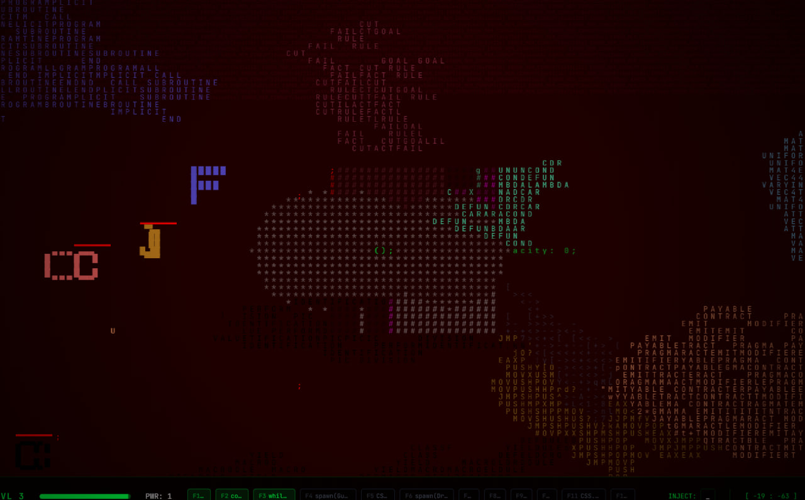

<div align="center">


```diff
+  ██████╗ ██████╗ ██╗██████╗       ██╗    ██╗ █████╗ ██████╗ ██████╗ ██╗ ██████╗ ██████╗ 
+ ██╔════╝ ██╔══██╗██║██╔══██╗      ██║    ██║██╔══██╗██╔══██╗██╔══██╗██║██╔═══██╗██╔══██╗
+ ██║  ███╗██████╔╝██║██║  ██║      ██║ █╗ ██║███████║██████╔╝██████╔╝██║██║   ██║██████╔╝
+ ██║   ██║██╔══██╗██║██║  ██║      ██║███╗██║██╔══██║██╔══██╗██╔══██╗██║██║   ██║██╔══██╗
+ ╚██████╔╝██║  ██║██║██████╔╝      ╚███╔███╔╝██║  ██║██║  ██║██║  ██║██║╚██████╔╝██║  ██║
+  ╚═════╝ ╚═╝  ╚═╝╚═╝╚═════╝        ╚══╝╚══╝ ╚═╝  ╚═╝╚═╝  ╚═╝╚═╝  ╚═╝╚═╝ ╚═════╝ ╚═╝  ╚═╝
```
**ENVIRONMENT: STABLE | REALITY: PROGRAMMABLE | ACCESS: GRANTED**

[](https://opensource.org/licenses/MIT)
[](https://nodejs.org/)
[](https://reactjs.org/)
[](https://tailwindcss.com/)
[](https://vitejs.dev/)
[]()

</div>

---

### 0x01. INITIALISATION

**Grid Warrior** est un simulateur de survie tactique où le code est la seule interface. Le projet est conçu pour fonctionner de manière autonome en tant que moteur de jeu "sandbox".

> [!IMPORTANT]
> **COMPATIBILITÉ IA :** L'intégration de Gemini Pro et Z-AI est **optionnelle**. Le jeu dispose d'un mode de base robuste. L'activation de l'IA permet simplement une génération procédurale et une interaction dynamique avancée via le prompt.

---

### 0x02. SPÉCIFICATIONS TECHNIQUES

| MODULE | ÉTAT | DESCRIPTION |
| :--- | :--- | :--- |
| **Core Engine** | `READY` | Système de rendu haute performance basé sur React/Vite. |
| **Logic Layer** | `ACTIVE` | Interprétation des commandes en temps réel. |
| **Visuals** | `STABLE` | Physique CSS et gestion dynamique des assets SVG. |
| **AI Nexus** | `STANDBY` | Module optionnel pour l'évolution assistée (Gemini). |

---
### 0x02. DÉMONSTRATIONS VISUELLES

<div align="center">
  
  
  <br />

  <i>Manipulation de la Grille & Altérations de Réalité</i>
</div>
### 0x03. EXTRAITS DU MANUEL

*   **Mutation :** `mutate({char: '@', radius: 10})` — Corrompt les entités adverses.
*   **Shielding :** `spawn(Guardian)` — Déploie un protocole de protection.
*   **Singularité :** `while(true) { ... }` — Purge complète de la grille.

<div align="center">

    
</div>

#### ■ COMMANDES SYSTÈME
*   `spawn(Guardian)` : Déploie une unité de défense.
*   `mutate(selector, property)` : Altère la structure moléculaire (CSS) des cibles.
*   `purge()` : Nettoyage complet de la mémoire de la grille.

#### ■ MODE IA (OPTIONNEL)
Si une `GEMINI_API_KEY` est détectée, le terminal débloque :
*   Génération de vagues d'ennemis intelligentes.
*   Interprétation de commandes en langage naturel.
*   Évolution adaptative du biome.

---


### 0x04. DÉPLOIEMENT DU TERMINAL
```bash
# Clonez le dépôt
git clone [https://github.com/glowku/The-grid-warrior.git](https://github.com/glowku/The-grid-warrior.git)

# Accédez au répertoire
cd The-grid-warrior

# Installation des dépendances
npm install

# Configuration (Facultatif : ajoutez votre clé IA ici si besoin)
cp .env.example .env.local

# Lancement du système
npm run dev
