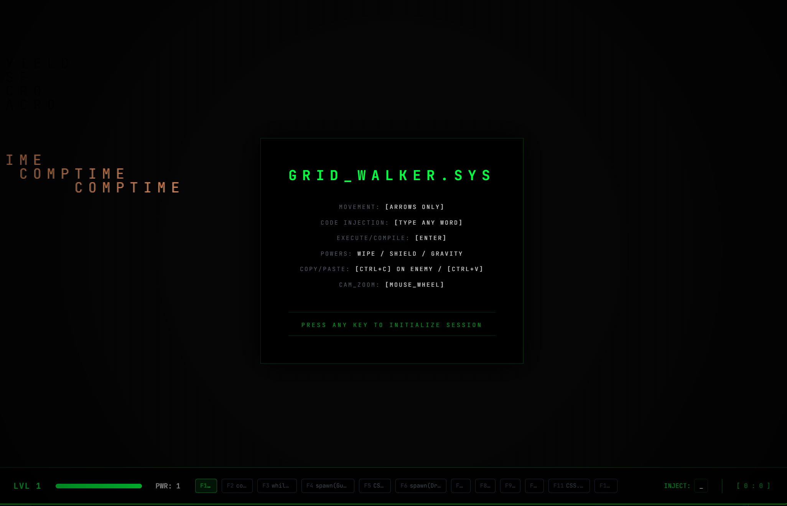
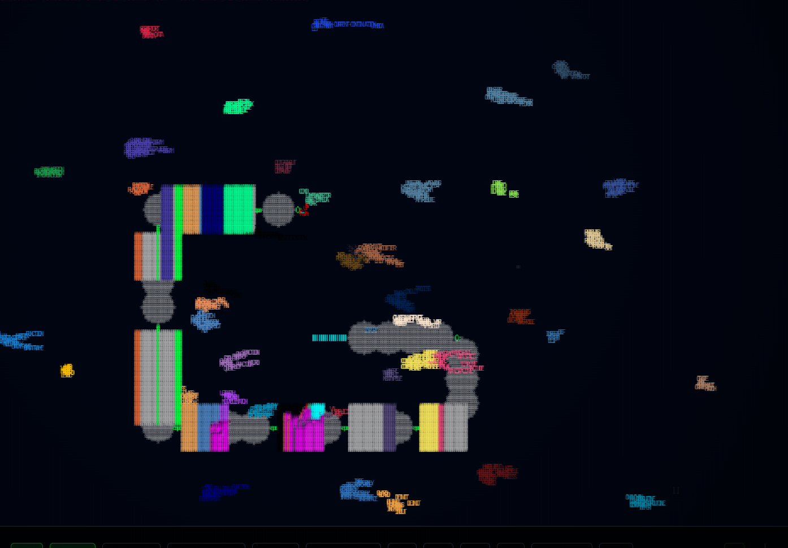

# ⚔️ GRID WARRIOR
**Le code n'est plus du texte. Le code est l'arme. Tapez pour vivre.**

---

## 🕹️ LE CONCEPT : "THE LIFE-CODE"
**The Grid Warrior** est un jeu de survie en temps réel où la grille est un champ de bataille dynamique. Ce projet, initialement un prototype AI Studio, a été **transcendé par l'IA (Gemini Pro & Z-AI)** pour devenir un moteur d'exécution dynamique unique.

Ici, tu ne joues pas avec une manette, tu joues avec du **code pur**. Chaque ligne que tu tapes dans ton buffer modifie la physique, la structure et l'intégrité de l'univers.

---

## 🎥 DÉMONSTRATION OPÉRATIONNELLE

### 1. Manipulation du Monde

> *Injection de SVG dynamiques, gestion des boucliers et combat de factions IA (Rust vs Python).*

### 2. Altération de la Réalité (CSS Physics)

> *Utilisation des propriétés CSS (`blur`, `bold`, `opacity`) pour glitcher l'IA adverse et fortifier tes murs.*

---

## 📜 EXTRAITS DU MANUAL OPÉRATIONNEL

### 🛠️ Commandes de Survie
* **Spawn d'Entités :** `spawn(Guardian, {shape: 'shield'})` pour protéger ton intégrité.
* **Arts Complexes :** `svg(dragon)` invoque une entité animée ultra-complexe dans la grille.
* **Mutation Brutale :** `mutate({char: '@', radius: 10})` corrompt les ennemis pour en faire tes alliés.
* **Black Hole :** `while(true) { ... }` génère un trou noir qui purge l'univers en boucle.

### 🎵 Musique Générative
Le moteur ne se contente pas d'afficher, il chante. Chaque action, chaque déplacement et chaque collision alimente une **symphonie générative** (gammes majeures/mineures fluides). Fini les bips d'erreur, place à l'harmonie de la destruction.

---

## 🚀 DÉPLOYER LE TERMINAL (Local)

Le projet est **Open Source**. Tu peux l'étendre, le modifier et injecter tes propres fonctions logiques.

1. **Clonage :** `git clone https://github.com/glowku/The-grid-warrior.git`
2. **Install :** `npm install`
3. **Key :** Set `GEMINI_API_KEY` dans `.env.local`
4. **Boot :** `npm run dev`

---

### REJOINS LA GRILLE. DOMINE LE CODE.

